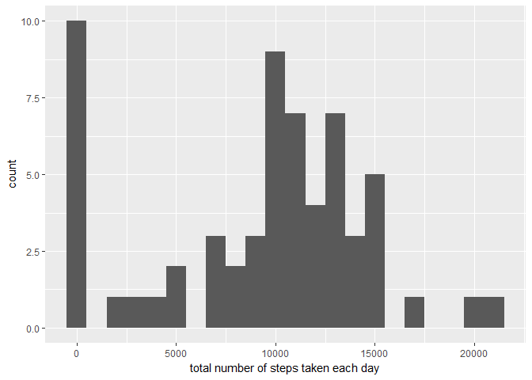
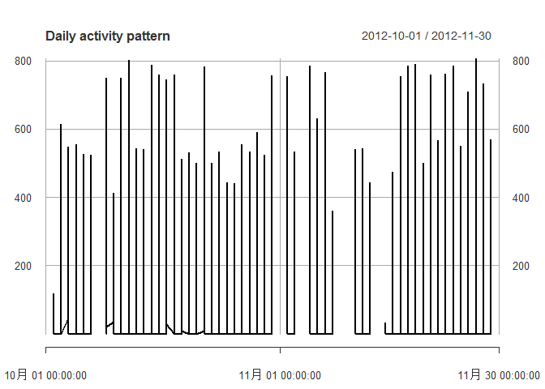
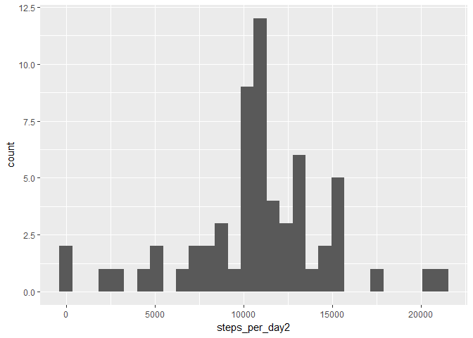
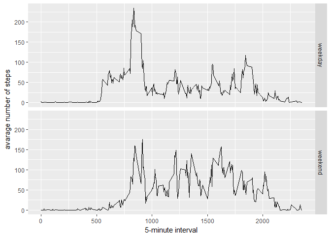

## Loading and preprocessing the data

```r
data <- read.csv("activity.csv")
```

## What is mean total number of steps taken per day?

```r
library(ggplot2)
```

```
## Warning: package 'ggplot2' was built under R version 3.4.4
```

```r
steps_per_day <- tapply(data$steps, data$date, FUN=sum, na.rm=TRUE)
qplot(steps_per_day, binwidth=1000, xlab="total number of steps taken each day")
```

<!-- -->

```r
mean_steps<-mean(steps_per_day, na.rm=TRUE)
median_steps<-median(steps_per_day, na.rm=TRUE)
```
## What is the average daily activity pattern?

```r
library(xts)
```

```
## Warning: package 'xts' was built under R version 3.4.4
```

```
## Loading required package: zoo
```

```
## Warning: package 'zoo' was built under R version 3.4.4
```

```
## 
## Attaching package: 'zoo'
```

```
## The following objects are masked from 'package:base':
## 
##     as.Date, as.Date.numeric
```

```r
hh <- xts(data$steps, as.Date(data$date, format='%Y-%m-%d'))
plot(hh,type = 'l',main='Daily activity pattern')
```

<!-- -->
  
## Find out the most steps taken per interval

```r
Steps_interval<- aggregate(x=list(Steps=data$steps),by=list(interval=data$interval), FUN=mean, na.rm=TRUE)
Moststeps<-Steps_interval[which.max(Steps_interval$Steps),]
Moststeps
```

```
##     interval    Steps
## 104      835 206.1698
```
`Moststeps`


## Imputing missing values

```r
library(Hmisc)
```

```
## Warning: package 'Hmisc' was built under R version 3.4.4
```

```
## Loading required package: lattice
```

```
## Loading required package: survival
```

```
## Loading required package: Formula
```

```
## 
## Attaching package: 'Hmisc'
```

```
## The following objects are masked from 'package:base':
## 
##     format.pval, units
```

```r
NAs<-sum(is.na(data$steps))


data2<-data
data2$steps<-impute(data2$steps,mean)

steps_per_day2<-tapply(data2$steps, data2$date,sum)
qplot(steps_per_day2)
```

```
## `stat_bin()` using `bins = 30`. Pick better value with `binwidth`.
```

<!-- -->

```r
mean(steps_per_day2)
```

```
## [1] 10766.19
```

```r
median(steps_per_day2)
```

```
## [1] 10766.19
```


## Are there differences in activity patterns between weekdays and weekends?

```r
data$week<-ifelse(as.POSIXlt(data$date)$wday %in% c(1:5) ,'weekday','weekend')

aggdata<-aggregate(steps ~ interval + week, data=data, mean)

ggplot(aggdata, aes(interval, steps)) + 
    geom_line() + 
    facet_grid(week ~ .) +
    xlab("5-minute interval") + 
    ylab("avarage number of steps")
```

<!-- -->
